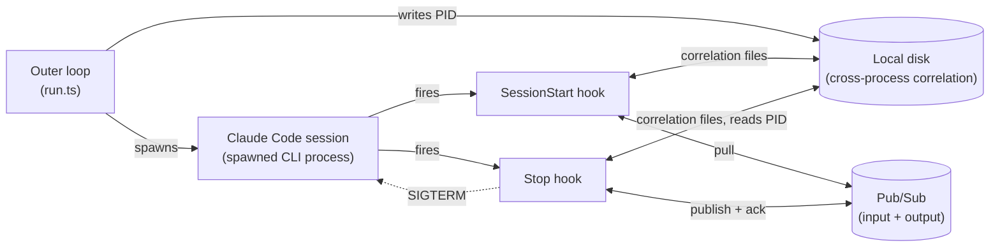

# Architecture: claude-automator

## Overview

`claude-automator` is the repo's one non-FaaS event-driven service (see the repo-root
[`docs/architecture.md`](../../docs/architecture.md)): a long-running Node/TS process that
repeatedly spawns a `claude` CLI session, feeds it a task pulled from Pub/Sub via a `SessionStart`
hook, and publishes the session's answer back via a `Stop` hook. It is the LLM-interpretation stage
for two inbound use cases, both answering on the shared `claude-automator-responses` topic:

- **QA** — `ASKED -> ANSWERED` (question in `metadata`); see the repo-root
  [`docs/use-cases/qa.md`](../../docs/use-cases/qa.md).
- **WEATHER** — `FETCHED -> ANSWERED` (interpretation prompt in `metadata` + weather JSON in
  `payload`); see the repo-root [`docs/use-cases/weather.md`](../../docs/use-cases/weather.md).

See where it sits in each full request flow via those system-level use-case docs, and this module's
own [`docs/use-cases/`](use-cases/) for its internal happy-path and edge-case sequences.

## Process model

Three independent OS processes cooperate per session, with **no shared memory or IPC channel**
between them:

1. **Outer loop** (`run.ts`) — a `while (true)` loop that spawns a fresh `claude` CLI child per
   iteration and never exits on its own.
2. **`claude` CLI process** — the spawned agent session. Its `SessionStart` and `Stop` lifecycle
   hooks each run as their own `ts-node` invocation, not as in-process callbacks.
3. **Hook processes** (`SessionStart` → `poll-useful-message.ts`, `Stop` → `end-session.ts`) — each
   a short-lived process that runs to completion and exits.

Coordination is therefore handed off through **the local filesystem** — see
[`docs/arch/disk-correlation.md`](arch/disk-correlation.md) for the four files involved (`PID_FILE`,
`UUID_PATH`, `ACK_ID_PATH`, `USE_CASE_PATH`) and why. This is the central design fact of the module;
most of what looks unusual elsewhere follows from it.

## Component diagram

Five moving parts across process boundaries — static structure only; for how they interact over one
request, see the sequence diagrams in [`docs/use-cases/`](use-cases/).

## Components

- **Outer loop** (`run.ts`) — supervises the lifecycle: spawns a `claude` CLI child each
  iteration, writes `PID_FILE`, and restarts forever regardless of how the previous session ended.
- **Claude Code session** — the spawned CLI process. Its `SessionStart`/`Stop` events are the only
  points where this module's own code runs.
- **SessionStart hook** (`poll-useful-message.ts`) — pulls one message off the input Pub/Sub
  subscriptions (two of them — QA and WEATHER; validating the envelope, retrying up to `POLL_COUNT`
  times), writes the correlation files (including the inbound `use_case`), and injects the task as
  session context.
- **Stop hook** (`end-session.ts`) — reads the correlation files, publishes the session's answer
  stamped with the inbound `use_case`, acknowledges the original input message against the
  subscription it came from, then sends `SIGTERM` to the Claude Code process via the PID file.
- **Local disk** — stands in for shared memory/IPC across three independent OS processes (outer
  loop, Claude Code, hook invocations); see [`arch/disk-correlation.md`](arch/disk-correlation.md)
  for exactly what's written/read where.
- **Pub/Sub** — the external transport in and out; see [`arch/messaging.md`](arch/messaging.md).

Both hooks also load `config.ts` (zod-validated env), make their Pub/Sub calls and file I/O via
`pubsub-client.ts`/`filesystem.ts`, and emit a completion metric via `metrics.ts` (see
[`arch/metrics.md`](arch/metrics.md)) — implementation details of the two hooks, not separate
architectural pieces.

## Multi-use-case handling

The service consumes two inbound use cases through one otherwise-uniform pipeline. Three points
differ by use case; everything else (spawn/kill loop, correlation-via-disk, single-session-at-a-time
shape) is shared:

1. **Inbound validation** accepts either `QA`/`ASKED` or `WEATHER`/`FETCHED` (the envelope schema is
   generalized from the former hardcoded `QA`/`ASKED` — see [`arch/messaging.md`](arch/messaging.md)).
2. **Agent-context assembly** is use-case-specific: QA hands the agent `metadata` alone (the
   question); WEATHER hands it `metadata` (weather-svc's interpretation prompt) plus `payload` (the
   weather JSON), joined with an XML-tag delimiter — `<prompt>…</prompt><data>…</data>`. The tag
   choice is claude-automator's; see [`use-cases/weather.md`](use-cases/weather.md)'s alignment note.
3. **Outbound `use_case` pass-through.** The answer echoes the inbound `use_case`
   (`QA -> QA/ANSWERED`, `WEATHER -> WEATHER/ANSWERED`) on both the body and the Pub/Sub attributes,
   and the input message is acked against the subscription it arrived on. Because the outbound runs
   in a *different* OS process (Stop hook) from the inbound (SessionStart), the `use_case` is carried
   across via a correlation file, from which both the outbound stamp and the ack-target subscription
   are derived — see [`arch/disk-correlation.md`](arch/disk-correlation.md).

## Configuration

All configuration is env-driven and validated at process start by `config.ts` (`schema.safeParse`
— the process exits immediately on an invalid config rather than failing later mid-session). See
[`.env.example`](../.env.example) for the full variable list: GCP project ID, the outbound topic ID,
the two inbound subscription IDs (QA + WEATHER), the four disk-file paths (the three correlation
files plus the `use_case` file), `POLL_INTERVAL_MS`/`POLL_COUNT`, and `OTLP_METRICS_URL`.

## Conventions (detail docs)

- [`docs/arch/messaging.md`](arch/messaging.md) — why the input side pulls instead of using push
  delivery, and the single-publish output path.
- [`docs/arch/disk-correlation.md`](arch/disk-correlation.md) — the three correlation files and
  the kill mechanism.
- [`docs/arch/metrics.md`](arch/metrics.md) — what's emitted to OTLP and at which point in the
  flow.
- [`docs/use-cases/`](use-cases/) — sequence diagrams for the happy path and edge cases.
- [`docs/deploy/README.md`](deploy/README.md) — how to build and run this module as a Docker
  container, including the deliberately manual `ANTHROPIC_API_KEY` setup step and a smoke test.

## Accepted risks / not yet solved

- **Deploy-order coupling with weather-svc.** claude-automator must be deployed with `WEATHER`/
  `FETCHED` inbound support *before* weather-svc goes live. Until then a `WEATHER`/`FETCHED` message
  fails envelope validation, nacks → redelivers → DLQ, and the failure surfaces only as a gateway
  timeout — the WEATHER error short-circuit covers weather-svc's own failures, not a claude-automator
  *inbound* rejection. See [`use-cases/weather.md`](use-cases/weather.md).
- **File-based correlation, not in-process.** The correlation files stand in for a shared-memory or
  IPC mechanism across three OS processes — a deliberate accepted gap, not an oversight; see
  `disk-correlation.md`'s "Known gap" section. Revisit if the module ever needs to handle concurrent
  sessions.
- **Ack-after-publish failure risks a duplicate answer.** If `subClient.acknowledge()` throws after
  a successful publish, the exception is caught by `end-session.ts`'s generic handler and
  mislabeled `reason=publish_error`, but the input message is never acked and will redeliver —
  tracked in the repo-root [`docs/backlog.md`](../../docs/backlog.md).
- **A silent disk-write failure in `SessionStart` can discard a session's answer.**
  `writeContent()`'s return value isn't checked when writing `UUID_PATH`/`ACK_ID_PATH`; a failed
  write there means `Stop` later aborts with `uuid_missing`, redelivering the input message but
  losing the answer the session already produced. Also tracked in `backlog.md`.
- **"Nothing to do" reports as a metric failure.** The benign empty-poll case and a genuine
  publish/ack error both currently land under `outcome=failure`, `reason=uuid_missing` /
  similar — conflating expected and unexpected outcomes in failure-rate metrics. See `metrics.md`
  and `backlog.md`.
- **QA is polled before WEATHER each round (possible WEATHER starvation).** `SessionStart` polls the
  QA subscription first and takes the first non-empty result (see "Multi-use-case handling" and T2),
  so under sustained QA load a pending WEATHER message can wait behind many QA sessions before it is
  picked up. Accepted for v1: the single-session-at-a-time process model already serializes both use
  cases and expected volume is low, so ordering rarely bites. Revisit with fairer arbitration
  (round-robin or oldest-first across the two subscriptions) if WEATHER latency becomes a problem.

See the repo-root [`docs/backlog.md`](../../docs/backlog.md) for the full list of deferred items and
where this module's code diverges from documented design.

## Task breakdown (WEATHER, phase 3)

Implementable units for adding the WEATHER inbound flow, with file ownership drawn so parallel
implementers never collide on a file. Cross-cutting gate: **T1–T3 must be deployed before weather-svc
goes live** (see "Accepted risks").

- **T1 — Config & env plumbing.** Owns `config.ts`, `.env.example`. Add
  `PUBSUB_WEATHER_SUBSCRIPTION_ID` (the WEATHER inbound subscription) and `USE_CASE_PATH` (the new
  correlation file). Fix the stale `.env.example` comment that sources the subscription id from
  `gateway-svc`'s provisioning script — it now comes from claude-automator's own
  `provision-pubsub.sh` output. *Acceptance:* both new vars are zod-validated at startup (process
  exits on missing/invalid); `.env.example` documents them with correct provenance.
- **T2 — Inbound generalization & `use_case` routing.** Sole owner of
  `.claude/hooks/utils/pubsub-client.ts` (depends on T1). (a) Generalize `gatewayMessageSchema` to
  accept `QA`/`ASKED` **or** `WEATHER`/`FETCHED`; (b) poll both subscriptions each round (QA first,
  then WEATHER; first non-empty wins); (c) assemble agent context — QA = `metadata`, WEATHER =
  `<prompt>{metadata}</prompt><data>{payload}</data>`; (d) persist the inbound `use_case` to
  `USE_CASE_PATH`; (e) `sendMessage` reads `use_case`, publishes `<use_case>/ANSWERED` (body +
  attributes), and acks against the subscription matching that `use_case`. *Acceptance:* a
  `WEATHER`/`FETCHED` message yields a `WEATHER/ANSWERED` publish on `claude-automator-responses` and
  an ack on the WEATHER subscription; the QA path is unchanged.
- **T3 — Provisioning.** Owns `scripts/provision-pubsub.sh`. Add subscription
  `claude-automator-weather-svc-results-sub` on `weather-svc-results`, filter
  `attributes.use_case="WEATHER" AND attributes.stage="FETCHED"`, DLQ
  `weather-svc-results-claude-automator-sub-dlq`. Update the header run-order note (must run after
  `weather-svc/scripts/provision-pubsub.sh` creates `weather-svc-results`); echo the new subscription
  id in the deploy hint. *Acceptance:* idempotent create of the subscription + DLQ; names match the
  system-level [`docs/use-cases/weather.md`](../../docs/use-cases/weather.md) table. Parallelizable
  with T1/T2.
- **T4 (optional) — Deploy/smoke docs.** Owns `docs/deploy/README.md` and
  `docs/deploy/smoke-test/`. Extend the smoke test to publish a `WEATHER`/`FETCHED` and assert a
  `WEATHER/ANSWERED`. Independent files; can defer.

`poll-useful-message.ts`, `end-session.ts`, and `filesystem.ts` need no changes — the generalization
lands entirely inside `pubsub-client.ts`.
