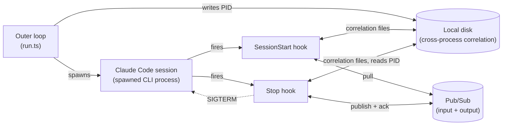

# Architecture: claude-automator

## Overview

`claude-automator` is the repo's one non-FaaS event-driven service (see the repo-root
[`docs/architecture.md`](../../docs/architecture.md)): a long-running Node/TS process that
repeatedly spawns a `claude` CLI session, feeds it a question pulled from Pub/Sub via a
`SessionStart` hook, and publishes the session's answer back via a `Stop` hook. It participates in
the QA use case as the `ASKED -> ANSWERED` stage — see the repo-root
[`docs/use-cases/qa.md`](../../docs/use-cases/qa.md) for where it sits in the full request flow,
and this module's own [`docs/use-cases/`](use-cases/) for its internal happy-path and edge-case
sequences.

## Process model

Three independent OS processes cooperate per session, with **no shared memory or IPC channel**
between them:

1. **Outer loop** (`run.ts`) — a `while (true)` loop that spawns a fresh `claude` CLI child process
   per iteration and never exits on its own.
2. **`claude` CLI process** — the spawned agent session itself. Its `SessionStart` and `Stop`
   lifecycle hooks each run as their own separate `ts-node` invocation, not as in-process
   callbacks.
3. **Hook processes** (`SessionStart` → `poll-useful-message.ts`, `Stop` → `end-session.ts`) — each
   is a short-lived process that runs to completion and exits.

Because none of these processes share state directly, coordination is handed off through **the
local filesystem** — see [`docs/arch/disk-correlation.md`](arch/disk-correlation.md) for the
three files involved (`PID_FILE`, `UUID_PATH`, `ACK_ID_PATH`) and why. This is the central design
fact of the module; most of what looks unusual elsewhere in this doc follows from it.

## Component diagram

Five moving parts, wired together across process boundaries. (For how these interact over the
course of one request, see the sequence diagrams in [`docs/use-cases/`](use-cases/) instead —
this diagram is the static structure only.)

## Components

- **Outer loop** (`run.ts`) — supervises the lifecycle: spawns a `claude` CLI child each
  iteration, writes `PID_FILE`, and restarts forever regardless of how the previous session ended.
- **Claude Code session** — the spawned CLI process itself. Its `SessionStart`/`Stop` lifecycle
  events are the only points where this module's own code runs.
- **SessionStart hook** (`poll-useful-message.ts`) — pulls one message off the input Pub/Sub
  subscription (validating the envelope, retrying up to `POLL_COUNT` times), writes the
  correlation files, and injects the question as session context.
- **Stop hook** (`end-session.ts`) — reads the correlation files, publishes the session's answer,
  acknowledges the original input message, then sends `SIGTERM` to the Claude Code process via the
  PID file.
- **Local disk** — stands in for shared memory/IPC across three independent OS processes (outer
  loop, Claude Code, hook invocations); see [`arch/disk-correlation.md`](arch/disk-correlation.md)
  for exactly what's written/read where.
- **Pub/Sub** — the external transport in and out; see [`arch/messaging.md`](arch/messaging.md).

Both hooks also load `config.ts` (zod-validated env) and, via `pubsub-client.ts`/`filesystem.ts`,
the Pub/Sub calls and file I/O described above — and both emit a metric on completion via
`metrics.ts` (see [`arch/metrics.md`](arch/metrics.md)). These are implementation details of the
two hook components above, not separate architectural pieces.

## Configuration

All configuration is env-driven and validated at process start by `config.ts` (`schema.safeParse`
— the process exits immediately on an invalid config rather than failing later mid-session). See
[`.env.example`](../.env.example) for the full variable list: GCP project/topic/subscription IDs,
the three disk-file paths, `POLL_INTERVAL_MS`/`POLL_COUNT`, and `OTLP_METRICS_URL`.

## Conventions (detail docs)

- [`docs/arch/messaging.md`](arch/messaging.md) — why the input side pulls instead of using push
  delivery, and the single-publish output path.
- [`docs/arch/disk-correlation.md`](arch/disk-correlation.md) — the three correlation files and
  the kill mechanism.
- [`docs/arch/metrics.md`](arch/metrics.md) — what's emitted to OTLP and at which point in the
  flow.
- [`docs/use-cases/`](use-cases/) — sequence diagrams for the happy path and edge cases.
- [`docs/deploy/README.md`](deploy/README.md) — how to build and run this module as a Docker
  container, including the deliberately manual `ANTHROPIC_API_KEY` setup step and a smoke test.

## Accepted risks / not yet solved

- **File-based correlation, not in-process.** `UUID_PATH`/`ACK_ID_PATH`/`PID_FILE` stand in for a
  shared-memory or IPC mechanism across three OS processes. This is a deliberate accepted gap, not
  an oversight — see `disk-correlation.md`'s "Known gap" section. Revisit if the module ever needs
  to handle concurrent sessions.
- **Ack-after-publish failure risks a duplicate answer.** If `subClient.acknowledge()` throws after
  a successful publish, the exception is caught by `end-session.ts`'s generic handler and
  mislabeled `reason=publish_error`, but the input message is never acked and will redeliver —
  tracked in the repo-root [`docs/backlog.md`](../../docs/backlog.md).
- **A silent disk-write failure in `SessionStart` can discard a session's answer.**
  `writeContent()`'s return value isn't checked when writing `UUID_PATH`/`ACK_ID_PATH`; a failed
  write there means `Stop` later aborts with `uuid_missing`, redelivering the input message but
  losing the answer the session already produced. Also tracked in `backlog.md`.
- **"Nothing to do" reports as a metric failure.** The benign empty-poll case and a genuine
  publish/ack error both currently land under `outcome=failure`, `reason=uuid_missing` /
  similar — conflating expected and unexpected outcomes in failure-rate metrics. See `metrics.md`
  and `backlog.md`.

See the repo-root [`docs/backlog.md`](../../docs/backlog.md) for the full list of deferred items and
where this module's code diverges from documented design.
