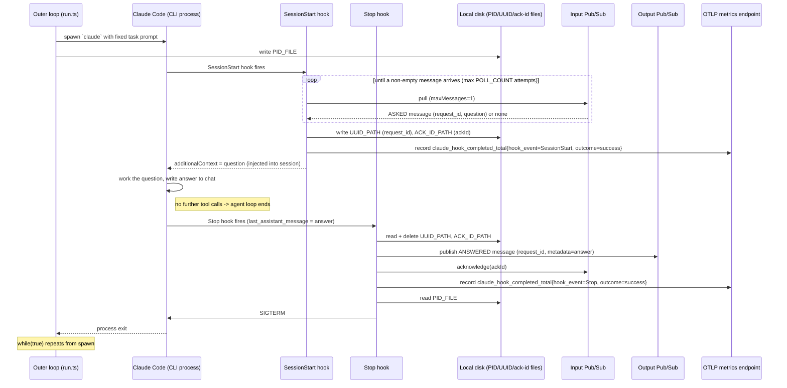

# claude-automator: happy path

How a single request flows through `claude-automator` end to end, on the happy path (no empty
polls exhausting `POLL_COUNT`, no validation failures, no publish/ack errors). See
[`nothing-to-do.md`](nothing-to-do.md) for what happens when polling finds nothing.

## Sequence diagram

## See also

The design decisions behind specific steps above are recorded separately in `../arch/`:

- [`../arch/messaging.md`](../arch/messaging.md) — the Pub/Sub transport as a whole, and why the
  input side pulls instead of listening for pushed messages.
- [`../arch/disk-correlation.md`](../arch/disk-correlation.md) — why request/ack/process identity
  is handed off via disk files, and what each of the three files carries.
- [`../arch/metrics.md`](../arch/metrics.md) — what gets emitted to the OTLP endpoint and at
  which point in this flow.
