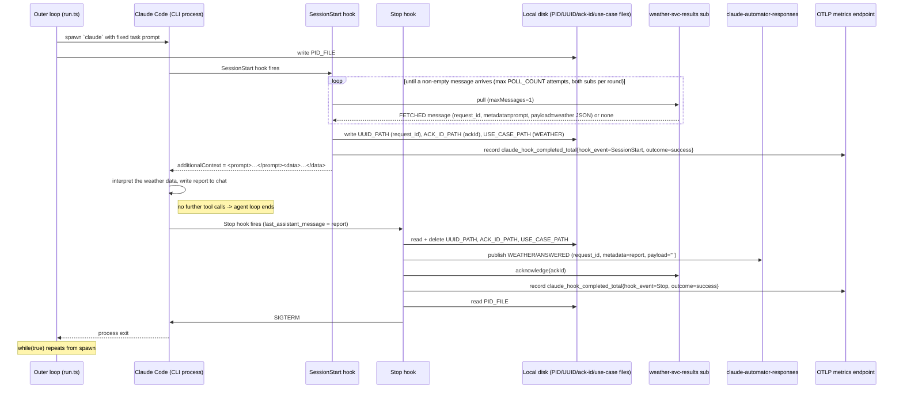

# claude-automator: WEATHER

claude-automator's slice of the WEATHER flow — the `FETCHED -> ANSWERED` stage. It's structurally
the same as the QA [`happy-path.md`](happy-path.md) (spawn/kill loop, correlation-via-disk, single
publish + ack); this doc shows only what differs. See the system-level
[`docs/use-cases/weather.md`](../../../docs/use-cases/weather.md) for the full cross-service picture.

Three WEATHER-specific differences from the QA happy path:

1. **Inbound subscription.** The message is pulled from `claude-automator-weather-svc-results-sub`
   (on weather-svc's `weather-svc-results` topic, filter `WEATHER AND FETCHED`), not the QA
   subscription. Each poll round tries both subscriptions; see [`../arch/messaging.md`](../arch/messaging.md).
2. **Agent context = prompt + data.** WEATHER carries the interpretation prompt in `metadata` and
   the open-meteo weather JSON in `payload`. `SessionStart` concatenates them with an XML-tag
   delimiter — `<prompt>{metadata}</prompt><data>{payload}</data>` — and hands that to the agent.
   (QA hands `metadata` alone.)
3. **Outbound `use_case` pass-through.** `SessionStart` writes `USE_CASE_PATH=WEATHER` alongside the
   `request_id`/`ackId` files; `Stop` reads it to publish `WEATHER/ANSWERED` (body + attributes) and
   to acknowledge against the WEATHER subscription. See [`../arch/disk-correlation.md`](../arch/disk-correlation.md).

## Sequence diagram

## Alignment note: the prompt/data XML tags

The `<prompt>…</prompt><data>…</data>` tag names are **claude-automator's choice** — weather-svc
supplies the prompt text (`metadata`) and the JSON (`payload`) but does not dictate how they're
wrapped. If weather-svc's interpretation prompt is ever authored to assume specific tag names or
references (e.g. "the JSON below"), the two must be aligned; treat these tags as the interface until
then. No shared contract doc exists yet.

## Edge cases

The QA edge cases apply unchanged — an empty poll on both subscriptions yields
[`nothing-to-do.md`](nothing-to-do.md); a malformed or wrong-`use_case`/`stage` envelope nacks →
redelivers → DLQ. The WEATHER-specific deploy-order risk (claude-automator must accept
`WEATHER`/`FETCHED` before weather-svc goes live) is in [`../architecture.md`](../architecture.md)'s
"Accepted risks."

## See also

- [`happy-path.md`](happy-path.md) — the QA happy path this mirrors; shared mechanics live there.
- [`../arch/messaging.md`](../arch/messaging.md) — the two-subscription poll and `use_case`-echoing publish.
- [`../arch/disk-correlation.md`](../arch/disk-correlation.md) — the `USE_CASE_PATH` correlation file.
