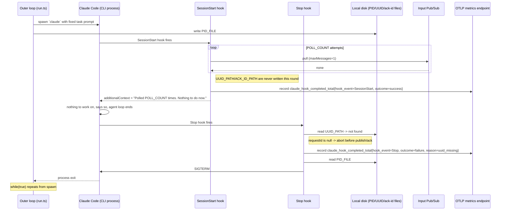

# claude-automator: nothing to do

What happens when `SessionStart` polls the input subscription and finds no message for
`POLL_COUNT` rounds in a row — the counterpart to [`happy-path.md`](happy-path.md).

## Sequence diagram



## Timing

Sleeps only happen *between* attempts, not after the last one (`pubsub-client.ts`: `if (i <
POLL_COUNT - 1) await sleep(POLL_INTERVAL_MS)`), so a fully-empty poll blocks the session for
about:

```
(POLL_COUNT - 1) x POLL_INTERVAL_MS
```

— one interval short of the naive `POLL_COUNT x POLL_INTERVAL_MS`. With the `.env.example`
defaults (`POLL_COUNT=2`, `POLL_INTERVAL_MS=5000`), that's `5s` of sleep, plus each `pull()`
call's own round-trip latency (variable — this is a lower bound).

## Safeguard

`sendMessage()` aborts with `reason=uuid_missing` if `UUID_PATH` is missing — already true here
(see [`../arch/disk-correlation.md`](../arch/disk-correlation.md)) — so an empty poll can't publish
an erroneous answer. Caveat: relies on the prior `Stop` run having deleted the file; a crash
beforehand could leave a stale `ackId` behind.
