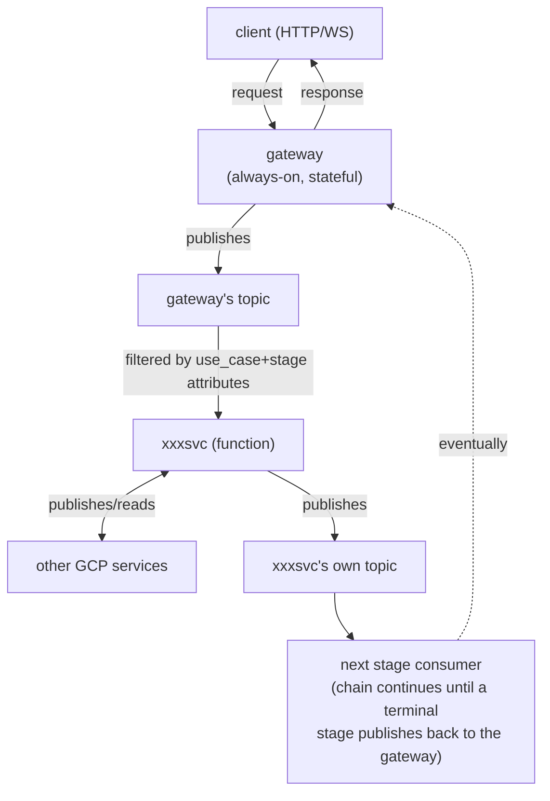

# Architecture

## Overview

This repo is a mono-repo of independently deployable services that together process requests
asynchronously via GCP Pub/Sub. There is exactly one always-on, stateful service (the gateway);
everything else is event-driven and, other than the gateway, expected to be deployable as a
Cloud Run Function.

- **gateway** (`gateway-svc`): the only always-online service. Accepts
  inbound requests (HTTP, WebSocket, Slack, etc.), assigns a `request_id` (UUID), and is
  responsible for eventually delivering a response back to whichever caller made the original
  request — regardless of what form that caller's connection took.
- **functions** (`xxxsvc`): each is a Cloud Run Function that reads from one Pub/Sub subscription
  and (optionally) writes to one or more Pub/Sub topics. Side effects are allowed and expected
  inside a function (see "Side effects in functions" below).
- **claude-automator**: a special, non-FaaS event-driven service (long-running Node/TS process),
  not deployed as a Cloud Run Function. It participates in the same message-based flow as any
  other consumer/publisher.
- **other GCP services**: a catch-all box that the gateway and any function may depend on for
  side effects (Firestore, Cloud Storage, Secret Manager, Cloud Tasks, etc.) — omitted from
  individual sequence diagrams to avoid clutter; see "Side effects in functions."

All request processing beyond the gateway's initial receipt is asynchronous: the gateway
publishes a message, and the response — whenever and via however many intermediate stages it
takes — eventually arrives back at the gateway as another message, keyed by `request_id`.

## The gateway

- The only stateful service in the system, and the only one required to be always-online (needed
  to support WebSocket and long-poll connections).
- On receiving a request, generates a `request_id` (UUID) and registers it in an in-memory
  `request_id → callback` map, then publishes the first message of the use case.
- A "callback" is deliberately abstract — it may be a long-polling HTTP response held open, an
  HTTP callback URL the caller supplied, a WebSocket send, a Slack `response_url` POST, etc. New
  callback kinds can be added without changing the gateway's core registry/timeout/shutdown
  logic.
- When a message arrives on the gateway's inbound subscription carrying a known `request_id`, the
  gateway looks up the registry entry, invokes the callback, and removes the entry.
- **Current implementation note**: the registry is in-memory only (single gateway instance
  assumption). Distributed/persistent callback handling is intentionally deferred — see
  `to-do.md`.

### Per-use-case timeout

Every use case must declare a timeout. The gateway starts a timer when it registers a
`request_id`; if no terminal message arrives before the timeout elapses:

1. The gateway synthesizes a failure response and delivers it through the same callback mechanism
   as a real response.
2. The gateway removes the `request_id` entry from its registry.

This is the sole failure-detection mechanism for a stuck/failed mid-chain function today — there
is no dedicated "error" message stage (see `to-do.md` for a possible fast-fail short-circuit).

### Graceful shutdown

Configured via `application.yaml`, three stages:

1. **Drain**: the gateway stops accepting new requests but keeps running, waiting up to a
   configurable duration for in-flight `request_id`s to receive their real response.
2. **Force-fail in-flight**: for every `request_id` still pending after the drain window, the
   gateway immediately fires that request's failure response (same synthesized-failure path as a
   timeout) and cleans up the registry entry.
3. **Forced shutdown**: the process exits (or the platform sends `SIGKILL` after its own grace
   period, e.g. Cloud Run's SIGTERM→SIGKILL window).

A newly started gateway instance has an empty registry. If it receives a response message for a
`request_id` it never registered (e.g. because the previous instance shut down and this is a
stale/duplicate redelivery), it logs a warning and discards the message. This is a deliberate,
accepted gap under the current in-memory/single-instance design — see `to-do.md`.

## Functions

- Each function is triggered by messages on the Pub/Sub subscription(s) it owns, and may publish
  to zero, one, or multiple downstream topics (fan-out to multiple next stages is allowed).
- **Idempotency is required**: given the same `request_id` + `stage`, reprocessing a message must
  produce the same outcome (no duplicate downstream publishes, no duplicated external side
  effects). This is necessary because Pub/Sub delivery is at-least-once.
  - **Exception: claude-automator.** Any function whose side effect is an LLM call cannot
    guarantee an identical output on reprocessing — the LLM will not return byte-identical
    results, only interchangeable ones. Such functions are exempt from output-identity, but must
    still be *safe to retry*: reprocessing must not duplicate downstream publishes or otherwise
    double-apply side effects that aren't idempotent by nature.

### Side effects in functions

Side effects are expected and encouraged inside a function. Beyond calling external APIs and
writing to databases, other side effects a function may perform:

- Publish to multiple downstream topics (fan-out).
- Call any **other GCP service** for information or storage (Firestore, Cloud Storage, Secret
  Manager, etc.) — modeled as a single dependency block in diagrams, since gateway and every
  function may reach it.
- Enqueue a delayed/scheduled continuation via **Cloud Tasks** for a business-logic-driven delay
  (e.g. "poll this external async job again in 30s") — distinct from Pub/Sub's transient-failure
  redelivery. A function creates a one-time Cloud Task with a future `scheduleTime` targeting its
  own HTTP entrypoint. Not yet used by any use case; the full pattern and its trigger condition
  live in `to-do.md`.

## Conventions (detail docs)

The message contract and the Pub/Sub wiring conventions live in their own docs under `arch/` so
this page stays focused on the system model. Read them when building or provisioning a stage:

- [`arch/messaging.md`](arch/messaging.md) — the shared message envelope, Protobuf/Pub-Sub schema
  enforcement (validation happens at publish time), and schema-evolution rules.
- [`arch/topics-and-provisioning.md`](arch/topics-and-provisioning.md) — topic/subscription/DLQ
  ownership and naming, and the per-service `provision-pubsub.sh` convention (each service
  provisions only what it owns).

## Accepted risks / not yet solved

- **A/B/C never share a database.** Stages in a use case are assumed not to have cross-stage data
  races since they don't share storage; this is accepted as a risk rather than actively verified.
  Tracked in `to-do.md`.
- **In-memory callback registry.** The gateway's `request_id → callback` map is not persisted or
  distributed. A gateway restart loses in-flight registrations (mitigated somewhat by the
  graceful-shutdown drain/force-fail sequence above, but a hard crash still loses state).
  Distributed/persistent handling is deferred — see `to-do.md`.

See `to-do.md` for the full roadmap and known gaps against this design.
