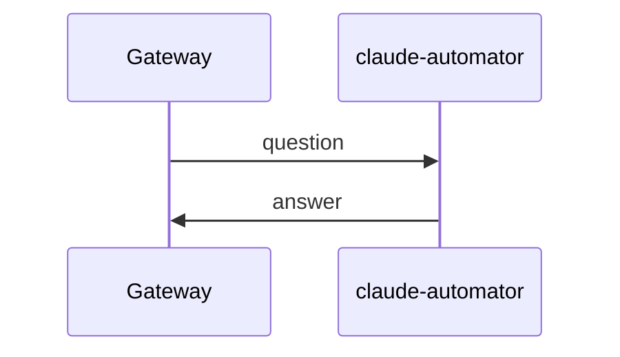

# Use case: QA

- `use_case` value: `QA`
- Timeout: 300000 ms (5 minutes) — matches `qa.async.timeout-millis` in `gateway-svc`'s
  `application.yaml` today; see `../to-do.md` for generalizing this into a declared per-use-case
  property.
- Message shape: the question and the answer are each conversational text, so both carry their
  content in the envelope's `metadata` field; `payload` is sent empty (`""`) on both legs. This is
  specific to this use case — a future use case may use `payload` for non-conversational data.

## Sequence diagram

## Stages

| Publisher | Subscriber | use_case | stage |
|---|---|---|---|
| gateway | claude-automator | `QA` | `ASKED` |
| claude-automator | gateway | `QA` | `ANSWERED` |

## Topics and subscriptions

Each service provisions only the infrastructure it owns (see
`../arch/topics-and-provisioning.md`): its own
outbound topic + DLQ, and its own subscription against whichever topic it consumes. Run
`gateway-svc/scripts/provision-pubsub.sh` before `claude-automator-dev/claude-automator/scripts/provision-pubsub.sh` (each
service's subscription targets the other service's topic, so the topic must exist first — see
each script's header comment for the exact order dependency). Once both topics exist, run
`../../scripts/provision-pubsub-schema.sh` to register and attach the shared envelope schema.

| Topic (owner) | Subscription (owner) | Filter | Dead-letter topic | Provisioned by |
|---|---|---|---|---|
| `gateway-requests` (gateway) | `claude-automator-gateway-requests-sub` (claude-automator) | `use_case="QA" AND stage="ASKED"` | `gateway-requests-claude-automator-sub-dlq` | `../../gateway-svc/scripts/provision-pubsub.sh` (topic) + `../../claude-automator-dev/claude-automator/scripts/provision-pubsub.sh` (subscription) |
| `claude-automator-responses` (claude-automator) | `gateway-claude-automator-responses-sub` (gateway) | `use_case="QA" AND stage="ANSWERED"` | `claude-automator-responses-gateway-sub-dlq` | `../../claude-automator-dev/claude-automator/scripts/provision-pubsub.sh` (topic) + `../../gateway-svc/scripts/provision-pubsub.sh` (subscription) |

## Known gaps for this use case

See `../to-do.md` for full detail. Notably: claude-automator still correlates requests via files
on disk (`UUID_PATH`, `ACK_ID_PATH`, populated from the envelope's `request_id`) rather than an
in-process mechanism. It does now validate the inbound envelope body (shape + `use_case`/`stage`)
against a zod schema before acting, nacking messages that fail validation.
