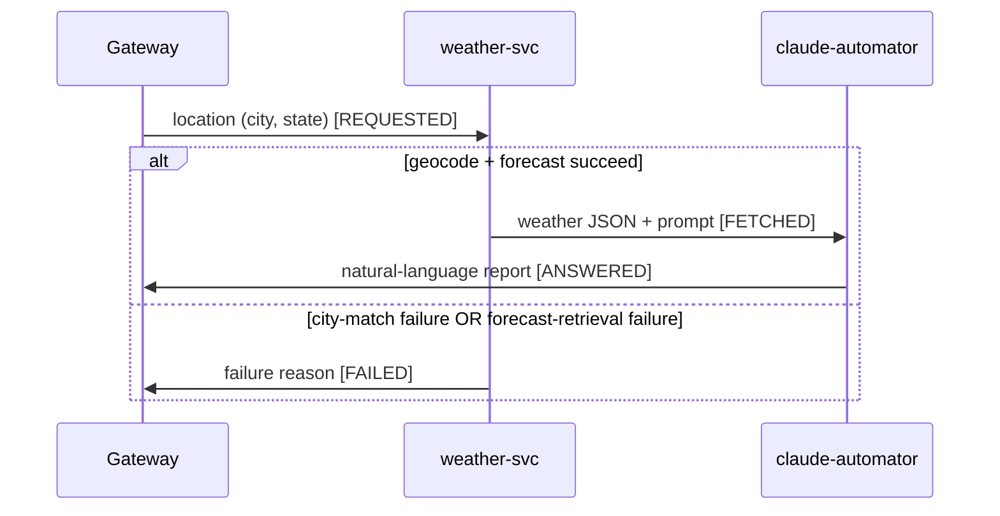

# Use case: WEATHER

- `use_case` value: `WEATHER`
- Timeout: 120000 ms (2 minutes). No gateway config key expresses this yet — the timeout is
  hardcoded to QA (`qa.*`), so this second use case forces the per-use-case generalization tracked
  in `../backlog.md` and `../PIPELINE.md`'s WEATHER technical notes.
- Trigger and delivery: Slack slash command `/get-weather <city>, <state>` (comma-delimited, since
  city names contain spaces), handled by the gateway's existing Slack Socket Mode integration on
  the `/ask` async pattern — ack within 3s, deliver the answer later via the caller's `response_url`
  (~30-min window, well past the 2-min timeout). Slack is the gateway's callback transport and, as
  in `qa.md`, is omitted from the sequence diagram (which shows only the async service chain).
- Scope (v1): Malaysia only (`countryCode=MY`).
- Message shape (first use case to use `payload` for structured data):
  - `REQUESTED` (gateway → weather-svc): location in `payload` (city + state — the state drives the
    client-side `admin1` filter); `metadata` empty.
  - `FETCHED` (weather-svc → claude-automator): open-meteo weather JSON in `payload`; weather-svc's
    interpretation/presentation prompt in `metadata`. claude-automator concatenates the two (prompt
    + data) with an XML-tag delimiter — the agreed prompt/data interface.
  - `ANSWERED` (claude-automator → gateway): natural-language report in `metadata`; `payload` empty
    (as in QA).
  - `FAILED` (weather-svc → gateway): human-readable reason in `metadata`; `payload` empty. The
    error short-circuit (see below).

## Sequence diagram

The `else` branch is the generic error short-circuit (`../architecture.md`, "Error short-circuit"):
on either of weather-svc's two terminal failures — no geocoding match, or forecast retrieval failed
— it publishes `FAILED` instead of continuing, and the gateway (subscribed to that stage) fails the
caller with the reason before the 2-minute timeout elapses.

## Stages

| Publisher | Subscriber | use_case | stage |
|---|---|---|---|
| gateway | weather-svc | `WEATHER` | `REQUESTED` |
| weather-svc | claude-automator | `WEATHER` | `FETCHED` |
| claude-automator | gateway | `WEATHER` | `ANSWERED` |
| weather-svc | gateway | `WEATHER` | `FAILED` |

The `FAILED` row is mutually exclusive with the `FETCHED`/`ANSWERED` pair — a request yields either
the two-hop happy path or the one-hop failure, never both.

## Topics and subscriptions

Each service provisions only what it owns (see `../arch/topics-and-provisioning.md`). This use case
adds one new topic — `weather-svc-results` (weather-svc's outbound) — and reuses `gateway-requests`
and `claude-automator-responses` via new filtered subscriptions. Two naming points:

- The gateway already subscribes to `claude-automator-responses` for QA
  (`gateway-claude-automator-responses-sub`, `QA AND ANSWERED`). Filters are immutable, so WEATHER
  needs a second subscription, disambiguated by use_case:
  `gateway-claude-automator-responses-weather-sub` (DLQ likewise). The QA subscription keeps its
  grandfathered name.
- `weather-svc-results` must get the shared `gateway-message` schema attached — extend
  `../../scripts/provision-pubsub-schema.sh`.

| Topic (owner) | Subscription (owner) | Filter | Dead-letter topic | Provisioned by |
|---|---|---|---|---|
| `gateway-requests` (gateway) | `weather-svc-gateway-requests-sub` (weather-svc) | `use_case="WEATHER" AND stage="REQUESTED"` | `gateway-requests-weather-svc-sub-dlq` | `../../gateway-svc/scripts/provision-pubsub.sh` (topic) + `../../weather-svc/scripts/provision-pubsub.sh` (sub + DLQ) |
| `weather-svc-results` (weather-svc) | `claude-automator-weather-svc-results-sub` (claude-automator) | `use_case="WEATHER" AND stage="FETCHED"` | `weather-svc-results-claude-automator-sub-dlq` | `../../weather-svc/scripts/provision-pubsub.sh` (topic) + `../../claude-automator-dev/claude-automator/scripts/provision-pubsub.sh` (sub + DLQ) |
| `weather-svc-results` (weather-svc) | `gateway-weather-svc-results-sub` (gateway) | `use_case="WEATHER" AND stage="FAILED"` | `weather-svc-results-gateway-sub-dlq` | `../../weather-svc/scripts/provision-pubsub.sh` (topic) + `../../gateway-svc/scripts/provision-pubsub.sh` (sub + DLQ) |
| `claude-automator-responses` (claude-automator) | `gateway-claude-automator-responses-weather-sub` (gateway) | `use_case="WEATHER" AND stage="ANSWERED"` | `claude-automator-responses-gateway-weather-sub-dlq` | `../../claude-automator-dev/claude-automator/scripts/provision-pubsub.sh` (topic) + `../../gateway-svc/scripts/provision-pubsub.sh` (sub + DLQ) |

## Provisioning run order

The three services form a dependency cycle: the gateway owns `gateway-requests` (weather-svc
subscribes) yet also subscribes to `weather-svc-results`, so its script must run both before
weather-svc (to create `gateway-requests`) and after it (once `weather-svc-results` exists). No
single linear pass satisfies every topic-before-subscription constraint, so the idempotent scripts
run in two passes:

1. `../../gateway-svc/scripts/provision-pubsub.sh` — creates `gateway-requests`; its WEATHER
   subscriptions can't be created yet (target topics absent).
2. `../../weather-svc/scripts/provision-pubsub.sh` — creates `weather-svc-results` and its sub on
   `gateway-requests`.
3. `../../claude-automator-dev/claude-automator/scripts/provision-pubsub.sh` — creates its sub on
   `weather-svc-results` (`claude-automator-responses` already exists from QA).
4. `../../gateway-svc/scripts/provision-pubsub.sh` again — creates the two WEATHER subscriptions now
   that their target topics exist.
5. `../../scripts/provision-pubsub-schema.sh` (extended for `weather-svc-results`) — attach the
   schema once all topics exist.

A topics-first/subs-second script split would let a single sweep work instead — a script-structure
decision left to phase 2/3 (see `../arch/topics-and-provisioning.md` and `../PIPELINE.md`'s WEATHER
technical notes).

## Known gaps for this use case

- **Circular provisioning dependency** — needs the two-pass run above (or the topics-first split).
- **claude-automator must be ready before weather-svc goes live.** Until claude-automator
  generalizes its inbound zod validation beyond `QA`/`ASKED`, a `WEATHER`/`FETCHED` message nacks →
  DLQ and the failure surfaces only as a timeout — the error short-circuit covers weather-svc's
  failures, not a claude-automator *inbound* failure.
- **Geocoding limits (v1, accepted)** — fuzzy search can over-match a near-miss name (e.g. "Ayer
  Itam" for "Ayer Hitam"), so weather-svc must verify the returned `name`; `admin1` filtering can't
  disambiguate two same-named towns within the same state; `countryCode=MY` only.
- Remaining downstream build work (claude-automator, gateway) is in `../PIPELINE.md`'s WEATHER
  technical notes.
