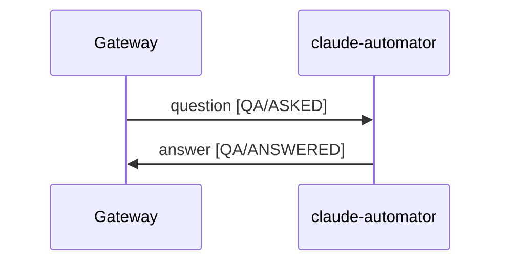

# gateway-svc: QA

The gateway-only view of the QA use case. The full cross-service flow (both stages, message shapes,
topics/subscriptions, provisioning) is authoritative in the repo-root
[`../../../docs/use-cases/qa.md`](../../../docs/use-cases/qa.md); this covers only what happens
**inside the gateway** between receiving the question and delivering the answer.

- `use_case`: `QA`
- Timeout: 300000 ms (5 min). As-built the flat `qa.async.timeout-millis`; target
  `gateway.use-cases.QA.timeout-millis` (see [`../architecture.md`](../architecture.md) "Timeout &
  liveness").
- Trigger/delivery: Slack `/ask <question>` (Socket Mode, ack-3s-then-`response_url`) **or** HTTP
  long-poll `POST /qa/async`. Both are gateway callback transports.

## Sequence diagram

Caller transport (Slack / HTTP, the gateway's callback) omitted; only the async chain shown.

## Stages (gateway's rows)

| Publisher | Subscriber | use_case | stage |
|---|---|---|---|
| gateway | claude-automator | `QA` | `ASKED` |
| claude-automator | gateway | `QA` | `ANSWERED` |

## Inside the gateway

1. **Receive** the question (`/ask` or `/qa/async`); wrap the caller's transport as an `AnswerSink`.
2. **Register** a `request_id → sink` entry in `PendingAnswerRegistry` (before publishing).
3. **Publish** `QA/ASKED` on `gateway-requests` (question in `metadata`, `payload` empty).
4. **Await** `QA/ANSWERED` on `gateway-claude-automator-responses-sub`; `registry.complete` delivers the
   answer via the sink and evicts.
5. **Timeout / liveness** — if no answer arrives, the HTTP path returns `504` and the sweeper fires
   `onExpire` (Slack timeout notice). See [`../architecture.md`](../architecture.md).
