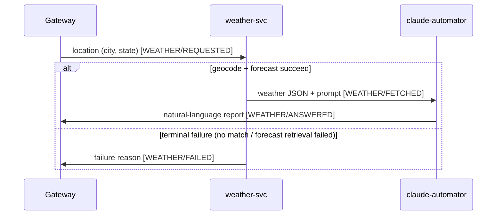

# gateway-svc: WEATHER

The gateway-only view of the WEATHER use case. The full cross-service flow (all four stages, message
shapes, topics/subscriptions, run order, gaps) is authoritative in the repo-root
[`../../../docs/use-cases/weather.md`](../../../docs/use-cases/weather.md); this covers only what
happens **inside the gateway** — issuing the request, delivering the answer or the failure.

- `use_case`: `WEATHER`
- Timeout: 120000 ms (2 min), declared as `gateway.use-cases.WEATHER.timeout-millis` — the flat `qa.*`
  config can't express a second use case, so this forces the per-use-case generalization (see
  [`../architecture.md`](../architecture.md) "Timeout & liveness", T5). Slack-only, so the sweeper's
  per-entry `expiresAt` is the sole liveness net (no HTTP `DeferredResult` fallback).
- Trigger/delivery: Slack `/get-weather <city>, <state>` (Socket Mode, ack-3s-then-`response_url`, same
  as `/ask`; comma-delimited because city names contain spaces).

## Sequence diagram

Caller's Slack transport (the gateway's callback) omitted; only the async chain shown.

## Stages (gateway's rows)

| Publisher | Subscriber | use_case | stage |
|---|---|---|---|
| gateway | weather-svc | `WEATHER` | `REQUESTED` |
| claude-automator | gateway | `WEATHER` | `ANSWERED` |
| weather-svc | gateway | `WEATHER` | `FAILED` |

`ANSWERED` (happy path) and `FAILED` (error short-circuit) are mutually exclusive for a request.

## Inside the gateway

1. **Receive** `/get-weather`, parse `city, state`; wrap the Slack transport as an `AnswerSink`.
2. **Register** a `request_id → sink` entry in `PendingAnswerRegistry` (before publishing).
3. **Publish** `WEATHER/REQUESTED` on `gateway-requests` (location in `payload`, `metadata` empty) via
   the parametric request service (T2).
4. **Await** either:
   - `WEATHER/ANSWERED` on `gateway-claude-automator-responses-weather-sub` → `registry.complete`
     delivers the report and evicts.
   - `WEATHER/FAILED` on `gateway-weather-svc-results-sub` → the generic error-stage handler (T4)
     delivers the reason via the **same `registry.complete` / `AnswerSink.deliver` path** and evicts,
     before the 2-min timeout elapses.
5. **Timeout** — if neither arrives, the sweeper fires `onExpire` (Slack timeout notice) at the entry's
   `expiresAt`.

## Gateway-side subscriptions added

| Topic | Subscription (gateway-owned) | Filter | DLQ |
|---|---|---|---|
| `claude-automator-responses` | `gateway-claude-automator-responses-weather-sub` | `WEATHER AND ANSWERED` | `claude-automator-responses-gateway-weather-sub-dlq` |
| `weather-svc-results` | `gateway-weather-svc-results-sub` | `WEATHER AND FAILED` | `weather-svc-results-gateway-sub-dlq` |

Provisioned by `gateway-svc/scripts/provision-pubsub.sh` (T6); two-pass run order
(`weather-svc-results` first) in the repo-root use-case doc.
