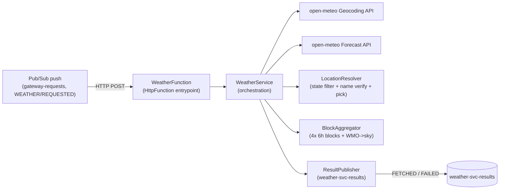

# Architecture: weather-svc

## Overview

`weather-svc` is a stateless **Cloud Run function** (GCP's rebranded "Cloud Functions 2nd gen") — the
repo's first true FaaS unit. In the WEATHER use case it is the geocode-and-forecast stage: it consumes
`WEATHER`/`REQUESTED` (a Malaysian city + state), resolves coordinates via the open-meteo Geocoding
API, fetches and aggregates a forecast via the open-meteo Forecast API, and publishes either
`WEATHER`/`FETCHED` (aggregated data + an interpretation prompt for claude-automator) or the terminal
`WEATHER`/`FAILED` (a human-readable reason, short-circuiting back to the gateway).

Authoritative cross-service flow: repo-root
[`docs/use-cases/weather.md`](../../docs/use-cases/weather.md). Zoomed-in per-service view:
[`use-cases/weather.md`](use-cases/weather.md). System model:
[`docs/architecture.md`](../../docs/architecture.md). Envelope:
[`docs/arch/messaging.md`](../../docs/arch/messaging.md).

**Scope (v1): Malaysia only** (`countryCode=MY`).

## Runtime and stack

Plain **Java 21 Cloud Run function**, deliberately *not* Spring Boot: the repo reserves Spring Boot for
the always-on, stateful gateway (`gateway-svc`); weather-svc is stateless, event-driven, and
short-lived per invocation — the FaaS shape the system model reserves for `xxxsvc` functions — where a
Spring context only adds cold-start weight and wiring it does not need.

Stack, modeled on the knowledgebase POC
`/Users/jameshskoh/knowledgebase/frameworks/gcp/function/cloud-run-java-pubsub-relay-poc.md`:

- **Java 21**, single Maven module (`jar`), standard `src/main/java` + `src/test/java` (no separate
  test module — weather-svc is small).
- `com.google.cloud.functions:functions-framework-api` (scope `provided`) — the buildpack wraps the
  function class in an HTTP server; not bundled into the artifact.
- `com.google.cloud:libraries-bom` (import BOM) pinning `com.google.cloud:google-cloud-pubsub` for the
  outbound `Publisher`.
- `com.google.code.gson:gson` for envelope + open-meteo JSON parsing.
- `com.google.cloud.functions:function-maven-plugin` (optional, local `mvn function:run` only).
- Outbound HTTP via the JDK's `java.net.http.HttpClient` — no extra dependency. (The POC is a relay
  with empty logic, so it shows no HTTP client; that is generic Java, not a gap.)
- **No Dockerfile** — source-based buildpack deploy (`gcloud run deploy --source . --function <target>
  --base-image java21`), per the POC. See [`docs/deploy/`](deploy/).

### Trigger: HttpFunction behind a Pub/Sub *push* subscription

weather-svc implements **`HttpFunction`** (not `CloudEventsFunction`), invoked by a Pub/Sub **push**
subscription — **not an Eventarc trigger**.

- **Why not Eventarc.** Eventarc manages its own subscription under the hood, muddying this repo's
  [`topics-and-provisioning.md`](../../docs/arch/topics-and-provisioning.md) conventions: consumer-owned
  subscriptions, immutable `use_case`/`stage` attribute filters, per-subscription DLQ. weather-svc
  already owns a named subscription — `weather-svc-gateway-requests-sub` (filter `use_case="WEATHER"
  AND stage="REQUESTED"`, DLQ `gateway-requests-weather-svc-sub-dlq`). A plain push subscription
  preserves that ownership; the POC picks Eventarc only as Google's *default*, which does not apply to
  our convention.
- **Cost.** The push envelope is parsed manually: the inbound adapter reads `message.data` (base64 →
  envelope JSON) and `message.attributes` (`use_case`/`stage`/`request_id`). See
  [`arch/messaging.md`](arch/messaging.md).

## Component diagram

## Module layout (single module, `com.jameshskoh.weather`)

Internal package layering, not separate Maven modules. Ports (interfaces) sit between the orchestrator
and its collaborators so implementers can build against them in parallel.

| Package | Holds |
|---|---|
| `messaging.in` | `WeatherFunction` (the `HttpFunction` entrypoint), push-envelope parse, `GatewayMessage` envelope DTO, inbound `payload` → `LocationRequest` parse |
| `service` | `WeatherService` orchestration (resolve → forecast → aggregate → publish), error classification, and the composition root that wires the ports to their impls |
| `port` | Interfaces: `Geocoder`, `Forecaster`, `LocationResolver`, `BlockAggregator`, `ResultPublisher` |
| `domain` | Value objects: `LocationRequest`, `ResolvedLocation`, `ForecastData`, `BlockSummary`, `ForecastBlocks`, `SkyCondition`, `WeatherResult` |
| `openmeteo` | `Geocoder` + `Forecaster` impls over `java.net.http.HttpClient` + gson, plus response DTOs |
| `resolve` | `LocationResolver` impl (client-side `admin1` filter, fuzzy-name verification, deterministic pick) |
| `forecast` | `BlockAggregator` impl + `WmoCodeMapper` (WMO `weather_code` → `SkyCondition`) |
| `messaging.out` | `ResultPublisher` impl (Pub/Sub `Publisher`), `FETCHED`/`FAILED` builders, interpretation-prompt builder |
| `config` | Env-var config, validated at first use (fail fast on a missing var, POC `requireEnv` style) |

## Configuration

Env-driven (no config file), validated on first use — a missing required var throws immediately, per
the POC. Variables (finalized in phase 3):

- `GCP_PROJECT_ID` — project of the outbound topic.
- `WEATHER_RESULTS_TOPIC_ID` — `weather-svc-results` (outbound topic).
- `OPENMETEO_GEOCODING_URL` / `OPENMETEO_FORECAST_URL` — base URLs (defaulted; overridable for tests).
- `FORECAST_DAYS` — open-meteo `forecast_days` (default per phase 3; the guide uses 7).
- `HTTP_TIMEOUT_MS` — per-call open-meteo timeout.

`countryCode=MY` and the `Asia/Kuala_Lumpur` timezone are v1 constants, not config.

## Processing flow (summary)

1. Parse the push envelope → `GatewayMessage` + `LocationRequest` (`payload` = `{"city", "state"}`, the
   inbound contract; see [`arch/messaging.md`](arch/messaging.md)).
2. **Geocode** `city` via `GET /v1/search?name=<city>&countryCode=MY&count=10&language=en`.
3. **Resolve** client-side: filter `admin1 == state`; reject fuzzy over-match by normalized exact
   `name` match; among survivors pick highest `population` (missing = lowest), tiebreak lowest `id`. No
   survivor → `FAILED`. See [`arch/open-meteo-integration.md`](arch/open-meteo-integration.md).
4. **Forecast** the resolved coordinates via `GET /v1/forecast?...&timezone=Asia/Kuala_Lumpur`.
5. **Aggregate** into four 6-hour blocks (00–06 midnight, 06–12 morning, 12–18 afternoon, 18–00 night)
   with per-block stats + a deterministic WMO→sky classification.
6. **Publish** `WEATHER`/`FETCHED` (aggregated JSON in `payload`, interpretation prompt in `metadata`),
   or terminal `WEATHER`/`FAILED` (reason in `metadata`) on a resolution or forecast-retrieval failure.

## Error posture

Per the system "Error short-circuit" convention
([`docs/architecture.md`](../../docs/architecture.md)) and `weather.md`:

- **Terminal → publish `WEATHER`/`FAILED`** (specific reason; lets the gateway fail the caller before
  the 2-minute timeout): no geocoding match; a bad/undecodable request; or a transient open-meteo
  failure (5xx / network / timeout). **v1 does no in-process retry** — a transient error publishes
  straight as `FAILED` (retry deferred, [`docs/backlog.md`](../../docs/backlog.md)).
- **Nack → redeliver → DLQ** *only* when weather-svc genuinely cannot publish (outbound publish fails
  schema validation, or the process crashes): the input lands in
  `gateway-requests-weather-svc-sub-dlq`, replayable. The push handler signals this by returning
  non-2xx (Pub/Sub redelivers); a successful `FETCHED`/`FAILED` publish returns 2xx (ack). See
  [`arch/messaging.md`](arch/messaging.md).

## Idempotency and accepted risks

- **At-least-once redelivery can double-publish.** open-meteo calls are read-only (safe to repeat); the
  only non-idempotent effect is a duplicate `FETCHED`/`FAILED` publish if the input redelivers after a
  successful publish but a failed ack. Same at-least-once posture as the rest of the system (see
  claude-automator); v1 does not deduplicate. Tracked with the broader idempotency gap in
  [`docs/backlog.md`](../../docs/backlog.md).
- **Geocoding limits (v1, from `weather.md`):** `admin1` filtering cannot distinguish two same-named
  towns in the *same* state (deterministic pick chooses one); `countryCode=MY` only; fuzzy match can
  over-match a near-miss name (mitigated by name verification, not eliminated).
- **No in-process retry on transient open-meteo errors** — deferred (see Error posture).

## Conventions (detail docs)

- [`arch/open-meteo-integration.md`](arch/open-meteo-integration.md) — geocoding resolution + forecast
  block-aggregation rules.
- [`arch/messaging.md`](arch/messaging.md) — push trigger, inbound/outbound envelope mapping, `payload`
  contracts, error → ack/nack.
- [`use-cases/weather.md`](use-cases/weather.md) — the zoomed-in per-service sequence.
- [`deploy/`](deploy/) — source-based Cloud Run deploy + the push-subscription provisioning step.

---

## Phase-3 task breakdown

Implementable units with **non-overlapping file ownership** so parallel implementers never collide.
`port` interfaces + `domain` value objects (T1) are the seam every other task builds against. Base
package `com.jameshskoh.weather`; source under `weather-svc/src/main/java/...`, tests mirror packages
under `weather-svc/src/test/java/...`.

### T1 — Scaffold, build, config, domain, ports
- **Owns:** `weather-svc/pom.xml`; `config/*`; `domain/*` (`LocationRequest`, `ResolvedLocation`,
  `ForecastData`, `BlockSummary`, `ForecastBlocks`, `SkyCondition`, `WeatherResult`); `port/*`
  (`Geocoder`, `Forecaster`, `LocationResolver`, `BlockAggregator`, `ResultPublisher`).
- **Acceptance:** `mvn package` builds; `pom.xml` matches the POC dependency set (functions-framework-api
  `provided`, libraries-bom, google-cloud-pubsub, gson, function-maven-plugin); config throws on a
  missing required env var; domain objects + port interfaces compile and are documented. No Dockerfile
  (buildpack deploy).

### T2 — open-meteo client
- **Owns:** `openmeteo/*` — `Geocoder` + `Forecaster` impls over `java.net.http.HttpClient` + gson,
  plus response DTOs.
- **Acceptance:** geocoding call issues `GET /v1/search?name=<city>&countryCode=MY&count=10&language=en`
  and parses results (incl. absent `population`); forecast call issues the documented `/v1/forecast`
  query with `timezone=Asia/Kuala_Lumpur` and parses the hourly arrays; a 5xx/network/timeout surfaces
  as a typed transient failure (no retry). Unit tests use the exact sample JSON in the open-meteo guide.

### T3 — Location resolution
- **Owns:** `resolve/*` — `LocationResolver` impl.
- **Acceptance:** given the guide's 5-result "Ayer Hitam" fixture, filters to the requested `admin1`,
  rejects the "Kampung Ayer Itam" over-match by normalized-exact `name`, and for two same-state
  survivors picks deterministically (highest `population`, missing = lowest, tiebreak lowest `id`).
  Returns a typed no-match result (not an exception) that the orchestrator maps to `FAILED`.

### T4 — Block aggregation
- **Owns:** `forecast/*` — `BlockAggregator` impl + `WmoCodeMapper`.
- **Acceptance:** buckets hourly values into four 6-hour blocks (00–06/06–12/12–18/18–00) per day in
  local time; computes per block temp high/low, feels-like high/low, raining probability, and a
  dominant `SkyCondition` from `weather_code`; handles missing hourly values. Unit-tested against the
  guide's sample forecast JSON.

### T5 — Messaging (in + out)
- **Owns:** `messaging.in/*` — `WeatherFunction` (`HttpFunction` entrypoint), push-envelope parse,
  `GatewayMessage` DTO, `payload` → `LocationRequest` parse; `messaging.out/*` — `ResultPublisher` impl
  (Pub/Sub `Publisher`), `FETCHED`/`FAILED` builders, interpretation-prompt builder.
- **Acceptance:** parses the push envelope (base64 `message.data` + `message.attributes`); publishes
  `FETCHED` (aggregated JSON in `payload`, prompt in `metadata`) and `FAILED` (reason in `metadata`),
  each with `use_case`/`stage` set in **both** attributes and body, `request_id` echoed; the prompt
  matches the spec in [`arch/messaging.md`](arch/messaging.md).

### T6 — Orchestration
- **Owns:** `service/*` — `WeatherService` + the composition root wiring ports → impls; the T5
  entrypoint delegates to it.
- **Acceptance:** runs resolve → forecast → aggregate → publish; applies the error classification
  (no-match/bad-request/transient → `FAILED`; can't-publish/crash → non-2xx so Pub/Sub redelivers);
  returns 2xx after a successful `FETCHED`/`FAILED` publish.

### T7 — Provisioning + deploy
- **Owns:** `weather-svc/scripts/provision-pubsub.sh`; the `scripts/provision-pubsub-schema.sh`
  extension (add `weather-svc-results`); `weather-svc/docs/deploy/`.
- **Acceptance:** the script creates the `weather-svc-results` topic and weather-svc's own
  `weather-svc-gateway-requests-sub` (filter `WEATHER AND REQUESTED`) + its DLQ
  `gateway-requests-weather-svc-sub-dlq`, per `weather.md`'s table and two-pass run order; a **push**
  subscription variant (`--push-endpoint`) is added since the shared `create_subscription_if_missing`
  only makes pull subs (see [`arch/messaging.md`](arch/messaging.md)); the schema script attaches the
  shared `gateway-message` schema to `weather-svc-results`; the deploy doc covers source-based `gcloud
  run deploy` + the deploy-then-set-push-endpoint ordering.
