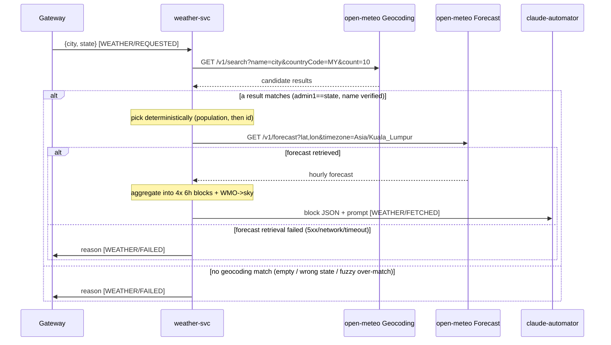

# weather-svc: WEATHER

The zoomed-in, weather-svc-only view of the WEATHER use case. The whole cross-service flow (all four
stages, message shapes, topics/subscriptions, provisioning run order, known gaps) is authoritative in
the repo-root [`../../../docs/use-cases/weather.md`](../../../docs/use-cases/weather.md); this doc covers
only what happens **inside weather-svc** between consuming `REQUESTED` and publishing `FETCHED` or
`FAILED`.

- `use_case` value: `WEATHER`
- weather-svc's stages: consumes `WEATHER`/`REQUESTED`, publishes `WEATHER`/`FETCHED` (success) or
  terminal `WEATHER`/`FAILED` (error short-circuit).
- Scope (v1): Malaysia only (`countryCode=MY`).

## Sequence diagram

open-meteo's two APIs are shown as direct calls; the inbound push and outbound Pub/Sub topics are
omitted for readability (see the stage table). The 2-minute timeout and the caller's Slack transport
live at the gateway, out of scope here.

## Stages (weather-svc's rows only)

| Publisher | Subscriber | use_case | stage |
|---|---|---|---|
| gateway | weather-svc | `WEATHER` | `REQUESTED` |
| weather-svc | claude-automator | `WEATHER` | `FETCHED` |
| weather-svc | gateway | `WEATHER` | `FAILED` |

`FETCHED` and `FAILED` are mutually exclusive for a request, and both publish to weather-svc's one topic
`weather-svc-results` (consumers filter by `stage`).

## Internal steps

1. **Parse** the push envelope → envelope + `payload` `{city, state}` (see
   [`../arch/messaging.md`](../arch/messaging.md)). Undecodable → `FAILED`.
2. **Geocode + resolve** — state filter, fuzzy-name verification, deterministic pick (see
   [`../arch/open-meteo-integration.md`](../arch/open-meteo-integration.md)). No survivor → `FAILED`.
3. **Forecast** the resolved coordinates. Transient failure (v1, no retry) → `FAILED`.
4. **Aggregate** into midnight/morning/afternoon/night blocks with per-block temp, feels-like, raining
   probability, and sky condition (description + emoji).
5. **Publish** `FETCHED` (block JSON in `payload`, interpretation prompt in `metadata`) → ack (2xx).

## Notes for this view

- The `FAILED` branch is the generic error short-circuit
  ([`../../../docs/architecture.md`](../../../docs/architecture.md)): the gateway, subscribed to
  `WEATHER`/`FAILED`, fails the caller with the reason before the 2-minute timeout elapses.
- weather-svc returns non-2xx (→ Pub/Sub redelivery → DLQ) **only** when it cannot publish at all
  (schema-violation publish failure or crash), not for business failures — those are `FAILED` messages.
  See [`../arch/messaging.md`](../arch/messaging.md).
- **Downstream dependency:** claude-automator must generalize its inbound validation to accept
  `WEATHER`/`FETCHED` before weather-svc goes live, or a `FETCHED` message nacks → DLQ at
  claude-automator and surfaces only as a gateway timeout (external work — see the repo-root use-case
  doc and `PIPELINE.md`).
